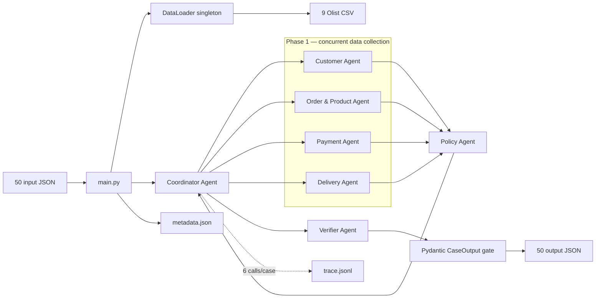
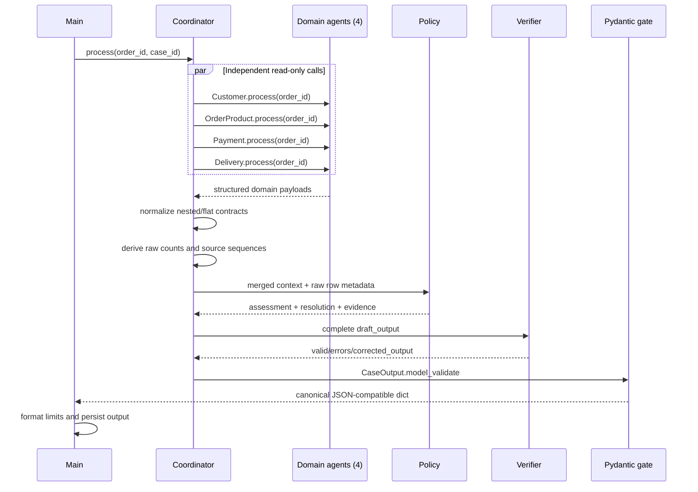

# Kiến trúc hệ thống Multi-Agent E-commerce Dispute Resolution

## 1. Mục tiêu và nguyên tắc thiết kế

Hệ thống điều tra 50 khiếu nại Olist theo `EC_POLICY_V2`. Mỗi case phải đối chiếu dữ liệu đơn hàng, khách hàng, sản phẩm, thanh toán và giao vận trước khi xác định issue, trách nhiệm, bằng chứng, mức hoàn tiền và action.

Các nguyên tắc chính:

- Ưu tiên logic deterministic cho phép tính và quy tắc nghiệp vụ; không để LLM tự tạo fact.
- Mỗi agent sở hữu một domain và trả về structured payload.
- Handoff là lời gọi hàm thật qua Coordinator, có trace cho từng lần gọi.
- Bốn agent thu thập dữ liệu chạy song song; Policy và Verifier chạy tuần tự theo dependency.
- Pydantic là hard gate cuối: output sai schema không được ghi ra file.
- Tên model được hardcode và tất cả model cấu hình đều không vượt quá 10B parameters.

## 2. Sơ đồ thành phần



## 3. Vai trò và quyền truy cập

| Thành phần | Vai trò | Dữ liệu được đọc | Dữ liệu được ghi |
|---|---|---|---|
| `main.py` | Load input, khởi tạo dependency, điều khiển batch | `input/*.json`, config | `output/*.json`, gọi Tracer persist |
| `DataLoader` | Load CSV một lần, tạo index/group lookup | `data/*.csv` | Chỉ trạng thái cache trong memory |
| `CustomerAgent` | Customer identity và lịch sử order | orders, customers | Structured result trong memory |
| `OrderProductAgent` | Item, seller, product, category | order_items, products, translation | Structured result trong memory |
| `PaymentAgent` | Đối soát item + freight với payment | order_items, order_payments | Structured result trong memory |
| `DeliveryAgent` | Delivery variance và seller handoff | orders, order_items | Structured result trong memory |
| `PolicyAgent` | Áp thứ tự ưu tiên `EC_POLICY_V2` | Context từ bốn domain agent | Assessment, root cause, refund, actions, evidence |
| `VerifierAgent` | Kiểm tra required fields, format, limit, timestamp | Draft do Coordinator tổng hợp | Corrected draft trong memory nếu cần |
| `Tracer` | Audit từng agent call và runtime | Input/output summary, duration, error | `logging/trace.jsonl`, `logging/metadata.json` |

Các domain agent không ghi file và không truy cập secret. Chỉ `main.py`/formatter ghi output; chỉ `Tracer` ghi audit artifact. `.env` chỉ cung cấp API key cho LLM abstraction và bị loại khỏi Git.

## 4. Luồng handoff end-to-end



Mỗi case tạo đúng sáu trace entries: `customer`, `order_product`, `payment`, `delivery`, `policy`, `verifier`. Sau batch có thêm một trace `BATCH_REVIEW` cho API call thật của Coordinator. Nếu agent ném exception, Coordinator trace lỗi rồi fail case; hệ thống không thay lỗi bằng dữ liệu rỗng.

## 5. Contract dữ liệu

### Phase 1

- Customer: `customer_context.customer_unique_id`, `related_order_ids`.
- Order/Product: `affected_entities` và `product_context`.
- Payment: totals, `difference_brl`, `reconciled`, `payment_types`, `payment_ids`.
- Delivery: timestamps, `delivery_variance_hours`, per-seller handoff và late seller IDs.

Coordinator có integration adapter `_section()` để chấp nhận cả payload nested lẫn flat từ module B/C. Sau khi normalize, Coordinator lấy `raw_items_count`, `raw_sellers_count`, `raw_pmts_count`, item sequence và payment sequence trực tiếp từ CSV. Việc này ngăn policy dùng nhầm array đã bị giới hạn để tính secondary issue hoặc evidence.

### Phase 2 và 3

Policy trả về năm section: `case_assessment`, `root_cause_analysis`, `evidence_ids`, `financial_resolution`, `resolution_actions`. Coordinator ghép với context Phase 1 thành `CaseOutput`. Verifier kiểm tra và giới hạn mảng, sau đó Pydantic xác nhận kiểu, required field và range confidence.

## 6. Quy tắc nghiệp vụ và tính nhất quán

Policy áp thứ tự ưu tiên:

1. `canceled_order_paid`
2. `unavailable_order_paid`
3. `late_delivery_seller`
4. `late_delivery_logistics`
5. `valid_split_payment`
6. `unsupported_late_claim`

Tiền và số giờ được làm tròn hai chữ số. Với order không có item, expected total, difference và reconciled là `null`. Payment type giữ thứ tự xuất hiện đầu tiên. Evidence chỉ được dựng từ order/item/payment sequence thực, responsible seller và root-cause code.

## 7. LLM abstraction và reproducibility

`src/llm/` tách provider khỏi agent. Model assignment nằm trong `src/config.py`: Qwen 2.5 7B, Llama 3.1 8B Instant và Gemma 2 9B; tất cả ≤10B. Pipeline dùng logic deterministic cho quyết định chấm điểm và một Groq API call thật bằng `llama-3.1-8b-instant` để audit completeness/taxonomy của toàn batch. LLM chỉ có vai trò advisory và không được phép thay đổi fact giao dịch; nhờ đó kết quả vẫn tái lập và tránh hallucination.

## 8. Khả năng phục hồi và observability

- DataLoader singleton tránh load lại khoảng 100 nghìn dòng cho mỗi agent/case.
- Phase 1 dùng `ThreadPoolExecutor` vì các tác vụ độc lập và read-only.
- Exception được trace với agent/case/duration rồi propagate lên batch runner.
- Trace được overwrite mỗi lượt chạy, không trộn với lượt cũ.
- Metadata ghi model, provider, parameter size, framework và runtime thực.
- Output chỉ được persist sau Verifier và Pydantic hard gate.

## 9. Kiểm thử và kết quả tích hợp A10

Các lệnh xác minh:

```bash
python -m pytest tests -q -p no:cacheprovider
python -m src.main
```

Kết quả lượt tích hợp ngày 2026-08-05:

| Kiểm tra | Kết quả |
|---|---:|
| Unit + integration + submission tests | 21/21 pass |
| Input/output cases | 50/50 |
| Pydantic schema validation | 50/50 pass |
| Business validator | 50/50 pass |
| Agent trace entries | 301 (300 case calls + 1 LLM batch review) |
| Trace errors | 0 |
| Agent calls mỗi case | 6 |
| API LLM calls | 1/1 thành công |

Submission được tạo bằng `python -m src.submission`. Bộ đóng gói chỉ đưa
`EC_001.json`–`EC_050.json` vào root của ZIP, mở lại từng member để validate và
loại hoàn toàn `.gitkeep`, directory prefix hoặc file lạ — các lỗi có thể làm
submission trượt hard gate dù nội dung case đúng.

Phân bố primary issue: 8 canceled, 6 unavailable, 10 late seller, 10 late logistics, 8 valid split payment và 8 unsupported late claim.
